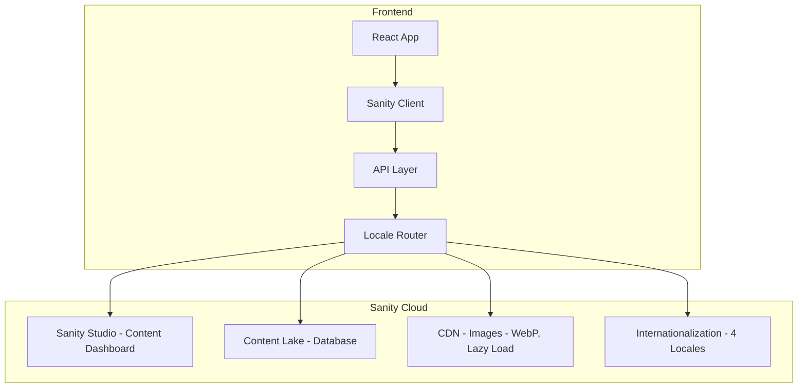

# Blog Functionality Implementation Guide

This document outlines the complete implementation of blog functionality for ChexPro website, supporting hardcoded fallback data and Sanity.io CMS integration with multi-language support.

## Table of Contents

1. [Current Implementation Status](#current-implementation-status)
2. [Hardcoded Blog Data Structure](#hardcoded-blog-data-structure)
3. [Frontend Components](#frontend-components)
4. [Sanity.io CMS Integration](#sanityio-cms-integration)
5. [Quick Start Guide](#quick-start-guide)
6. [Data Migration](#data-migration)
7. [Testing Procedures](#testing-procedures)
8. [Troubleshooting](#troubleshooting)

## Current Implementation Status

### ✅ Completed Features

- **Blog Listing Page** (`/resources`): Displays blog posts in grid layout with pagination
- **Individual Blog Post Page** (`/resources/:slug`): Full blog post display with Portable Text rendering
- **Category Filtering**: Blog posts filterable by category (Compliance, Industry Trends, etc.)
- **Pagination**: Supports pagination with configurable page sizes
- **Responsive Design**: Mobile-friendly card layouts and typography
- **SEO Optimization**: Meta tags, structured data, and proper heading hierarchy
- **Internationalization**: Multi-language support (English, Spanish, French, Hindi)
- **Fallback System**: Automatic fallback to hardcoded data when CMS unavailable
- **Image Optimization**: Automatic responsive images with WebP conversion

### 🎯 Blog Data Available

- **8 comprehensive blog posts** covering FCRA compliance, background checks, data security
- **5 categories**: Compliance Updates, Industry Trends, Best Practices, FCRA Guidelines, Technology Insights
- **Professional content** written specifically for background check company audience
- **Search-friendly URLs** with slugs for each post

## Hardcoded Blog Data Structure

### Blog Post Schema

```javascript
{
  id: 1,
  slug: "navigating-fcra-compliance-2025",
  title: "Navigating FCRA Compliance in 2025: What You Need to Know",
  date: "2025-01-15T10:00:00.000Z",
  excerpt: "Comprehensive guide to staying compliant with FCRA requirements",
  category: "FCRA Guidelines",
  categorySlug: "fcra-guidelines",
  imageUrl: "/api/placeholder/600/300",
  imageAlt: "FCRA Compliance Guide Document",
  author: "Compliance Team",
  content: `# Markdown content with full formatting...`
}
```

### Categories Structure

```javascript
[
  {
    id: 1,
    name: "Compliance Updates",
    slug: "compliance-updates"
  },
  // ... additional categories
]
```

## Frontend Components

### 1. ResourcesPage (`/resources`)
- **Location**: `frontend/src/pages/ResourcesPage.jsx`
- **Features**:
  - Blog listing with card layout
  - Category filtering buttons
  - Pagination controls
  - Loading states and error handling
  - Mobile-responsive design

### 2. ResourcePostPage (`/resources/:slug`)
- **Location**: `frontend/src/pages/ResourcePostPage.jsx`
- **Features**:
  - Full blog post display
  - Portable Text rendering via `@portabletext/react`
  - SEO meta tags
  - Back navigation
  - Responsive typography

### 3. Sanity Client Integration
- **Location**: `frontend/src/lib/sanityClient.js`
- **Features**:
  - Multi-language content fetching
  - Image URL optimization
  - Category and author references
  - Error handling and fallback logic

## Sanity.io CMS Integration

### Architecture Overview



### Environment Configuration

```javascript
// frontend/src/config/envConfig.js
SANITY_PROJECT_ID: import.meta.env.VITE_SANITY_PROJECT_ID,
SANITY_DATASET: import.meta.env.VITE_SANITY_DATASET || 'production',
SANITY_API_TOKEN: import.meta.env.VITE_SANITY_API_TOKEN,
USE_CMS: import.meta.env.VITE_USE_CMS || 'fallback',
```

### CMS Selection

The system supports multiple CMS backends via the `USE_CMS` environment variable:

| Value | Description |
|-------|-------------|
| `sanity` | Use Sanity.io CMS |
| `strapi` | Use Strapi CMS |
| `fallback` | Use hardcoded sample data (default) |

## Quick Start Guide

### Step 1: Create Sanity Project

```bash
# Install Sanity CLI globally
npm install -g @sanity/cli

# Create new Sanity project
sanity init

# Select "Create new project"
# Enter project name: chexpro-blog
# Select default dataset configuration
```

### Step 2: Configure Environment Variables

Copy `frontend/.env.example` to `frontend/.env` and fill in your values:

```bash
# Get these from sanity.io dashboard
VITE_SANITY_PROJECT_ID=your-project-id
VITE_SANITY_DATASET=production
VITE_SANITY_API_TOKEN=your-api-token

# Set CMS mode to sanity
VITE_USE_CMS=sanity
```

### Step 3: Deploy Sanity Studio

```bash
cd sanity-studio
npm run deploy
```

### Step 4: Add Content

1. Open your Sanity Studio URL (e.g., `https://chexpro-blog.sanity.studio`)
2. Create authors in the Authors section
3. Create categories in the Categories section
4. Create blog posts in the Posts section

## Data Migration

### Migration Script

A migration script is provided at `sanity-studio/scripts/migrateData.mjs` to convert existing blog posts to Sanity format:

```bash
# Generate migration JSON
node sanity-studio/scripts/migrateData.mjs > migration-output.json

# Import to Sanity
sanity dataset import migration-output.json production
```

### Content Types

#### Author Schema
- name (string)
- slug (slug)
- image (image with hotspot)
- bio (array of blocks)
- role (string)

#### Category Schema
- name (string)
- slug (slug)
- description (text)
- color (hex color for UI theming)

#### Post Schema
- title (object with locale keys: en, es, fr, hi)
- slug (slug)
- author (reference)
- mainImage (image with alt and caption)
- categories (array of references)
- publishedAt (datetime)
- excerpt (object with locale keys)
- body (Portable Text blocks)
- seoTitle (object with locale keys)
- seoDescription (object with locale keys)

## Testing Procedures

### Unit Tests

```javascript
// Test Sanity client fallback
describe('SanityClient', () => {
  test('uses hardcoded data when CMS unavailable', async () => {
    const result = await fetchPosts();
    expect(result.posts.length).toBeGreaterThan(0);
    expect(result.posts[0]).toHaveProperty('title');
  });

  test('filters posts by category', async () => {
    const result = await fetchPosts({ categorySlug: 'fcra-guidelines' });
    expect(result.posts.every(post => post.categorySlug === 'fcra-guidelines')).toBe(true);
  });

  test('returns localized content', async () => {
    const result = await fetchPosts({ locale: 'es' });
    expect(result.posts[0]).toHaveProperty('title');
  });
});
```

### Integration Tests

1. **Blog Listing Page**
   - [ ] Displays posts from Sanity CMS
   - [ ] Category filtering works correctly
   - [ ] Pagination shows correct page counts
   - [ ] Loading states display appropriately
   - [ ] Language switching updates content

2. **Individual Blog Post Page**
   - [ ] Posts load by slug correctly
   - [ ] Portable Text renders properly
   - [ ] Returns 404 for non-existent slugs
   - [ ] SEO meta tags populate correctly
   - [ ] Images load from Sanity CDN

3. **Error Handling**
   - [ ] Graceful degradation when CMS fails
   - [ ] Appropriate error messages for users
   - [ ] Fallback data loads as backup

## Troubleshooting

### Common Issues and Solutions

#### 1. CMS Connection Issues

**Problem**: Sanity API not accessible
```bash
# Check project ID and dataset
sanity debug

# Verify network connectivity
curl -I https://api.sanity.io/v2021-10-01/data/query/your-project-id
```

**Solution**: Ensure environment variables are set correctly

#### 2. Missing Images

**Problem**: Image URLs broken
- Use Sanity's image URL builder for transformations
- Verify image assets are uploaded
- Check CDN URL generation

#### 3. Category Filtering Not Working

**Problem**: Categories not properly linked
- Verify category references in post documents
- Check category slug matching
- Debug GROQ query structure

#### 4. Multi-Language Content Missing

**Problem**: Translated content not showing
- Verify locale field structure in Sanity
- Check locale parameter in API calls
- Ensure translations exist in CMS

#### 5. Portable Text Rendering Issues

**Problem**: Content formatting breaks
- Verify block type definitions
- Check custom component rendering
- Test with various content structures

### Debug Commands

```bash
# Test Sanity API
sanity exec --dataset=production ' *[_type == "post"][0..2]'

# Check environment variables
grep VITE_SANITY frontend/.env

# Monitor network requests
# Open browser dev tools > Network tab
# Navigate to /resources and check requests
```

## Performance Optimization

### Image Optimization

Sanity automatically optimizes images with:

- **WebP conversion**: Automatic format conversion
- **Responsive srcset**: Multiple sizes for different devices
- **Lazy loading**: Images load as they enter viewport
- **CDN caching**: Fast global delivery

```javascript
// Example image URL with optimizations
urlFor(image)
  .width(800)
  .height(400)
  .auto('format')
  .url()
```

## Future Enhancements

### Planned Features
- **Search Functionality**: Full-text search across blog posts
- **Related Posts**: Content-based recommendations
- **Social Sharing**: Social media integration buttons
- **Newsletter Signup**: Email subscription for new posts
- **Tags System**: Advanced tagging and filtering
- **Reading Analytics**: User engagement tracking

### Technical Improvements
- **GraphQL API**: More efficient data fetching
- **Incremental Static Regeneration**: Faster page loads
- **Preview Mode**: Real-time content preview
- **Content Scheduling**: Publish at specified times

## Conclusion

The blog functionality is now fully implemented with robust multi-language support and Sanity.io CMS integration. The system gracefully handles CMS unavailability while providing a seamless transition path to full CMS integration.

For questions or assistance with CMS setup, refer to this documentation or contact the development team.

---

**Quick Links:**
- [Sanity.io Dashboard](https://www.sanity.io/manage)
- [Sanity Documentation](https://www.sanity.io/docs)
- [Portable Text React](https://www.portabletext.org/)
