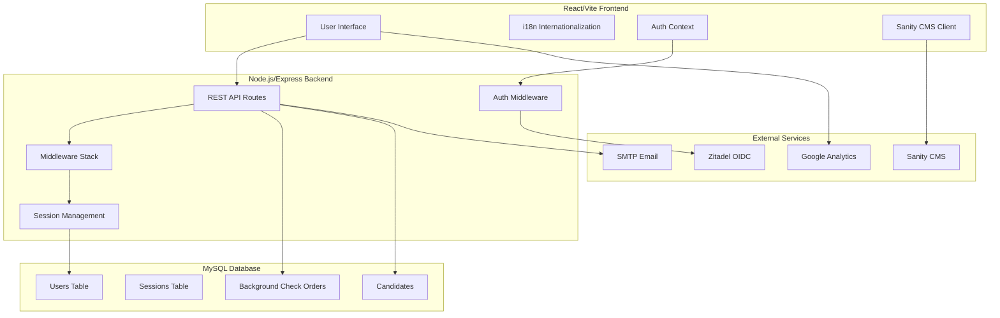

# ChexPro Production-Readiness Audit Plan

## Overview
This document outlines the comprehensive production-readiness review plan for the ChexPro web application - a background screening services platform with React/Vite frontend and Node.js/Express backend.

## System Architecture Summary

## Audit Categories

### 1. Code Quality and Architecture Analysis

#### 1.1 Code Patterns and Conventions
- [ ] Review naming conventions consistency across frontend and backend
- [ ] Check for duplicate code blocks that should be refactored
- [ ] Identify complex functions exceeding 50 lines
- [ ] Verify consistent error handling patterns

#### 1.2 Code Cleanliness
- [ ] Search for and document console.log statements in production code
- [ ] Identify commented-out code blocks
- [ ] Find unused imports and dead code
- [ ] Check for hardcoded values that should be environment variables

#### 1.3 TypeScript/Type Safety
- [ ] Identify any usage of TypeScript
- [ ] Document areas where type safety could be improved
- [ ] Check for proper prop types in React components

### 2. Security Vulnerabilities Assessment

#### 2.1 Authentication Security
- [ ] Review JWT implementation and token expiration
- [ ] Verify CSRF protection on all state-changing endpoints
- [ ] Check session management security
- [ ] Audit password hashing implementation
- [ ] Review MFA implementation security

#### 2.2 Input Validation
- [ ] Check SQL injection protection - verify parameterized queries
- [ ] Review XSS prevention measures
- [ ] Verify input sanitization on all endpoints
- [ ] Check file upload validation if applicable

#### 2.3 Authorization
- [ ] Verify IDOR protection on all resource endpoints
- [ ] Check role-based access control implementation
- [ ] Review API endpoint authorization

#### 2.4 Security Headers and CORS
- [ ] Review CSP configuration
- [ ] Verify CORS settings
- [ ] Check HSTS implementation
- [ ] Review cookie security attributes

#### 2.5 Sensitive Data Handling
- [ ] Check for exposed secrets in code
- [ ] Verify proper logging sanitization
- [ ] Review token storage practices

### 3. API and Backend Testing

#### 3.1 Endpoint Coverage
| Endpoint | Method | Auth Required | Validation Status |
|----------|--------|---------------|-------------------|
| /api/form/contact | POST | No | Pending |
| /api/form/demo | POST | No | Pending |
| /api/form/csrf-token | GET | No | Pending |
| /api/auth/login | POST | CSRF | Pending |
| /api/auth/logout | POST | Session | Pending |
| /api/auth/csrf-token | GET | No | Pending |
| /api/dashboard/stats | GET | Session/JWT | Pending |
| /api/dashboard/recent-orders | GET | Session/JWT | Pending |
| /api/dashboard/orders | POST | Session/JWT | Pending |
| /api/mfa/setup | GET | JWT | Pending |
| /api/mfa/verify | POST | No | Pending |
| /api/mfa/disable | POST | JWT | Pending |
| /health | GET | Bearer Token | Pending |
| /api/metrics | GET | Bearer Token | Pending |
| /api/docs | GET | Bearer Token | Pending |

#### 3.2 Response Validation
- [ ] Verify proper HTTP status codes
- [ ] Check error message consistency
- [ ] Validate response structure

### 4. Database and Data Integrity

#### 4.1 Schema Review
- [ ] Verify foreign key constraints
- [ ] Check index coverage
- [ ] Review cascade delete rules
- [ ] Check for missing NOT NULL constraints

#### 4.2 Query Analysis
- [ ] Identify potential N+1 queries
- [ ] Check for missing pagination
- [ ] Review transaction handling

### 5. Frontend and User Experience

#### 5.1 Form Validation
- [ ] Client-side validation review
- [ ] Server-side validation verification
- [ ] Error message clarity

#### 5.2 Loading and Error States
- [ ] Loading indicators presence
- [ ] Error boundary implementation
- [ ] Empty state handling

#### 5.3 Accessibility
- [ ] ARIA labels presence
- [ ] Keyboard navigation
- [ ] Screen reader compatibility

### 6. Edge Cases and Boundary Testing

#### 6.1 Input Boundaries
- [ ] Empty strings, null, undefined handling
- [ ] Maximum length strings
- [ ] Special characters and Unicode
- [ ] Negative numbers and zero values

#### 6.2 Session Management
- [ ] Session expiry behavior
- [ ] Concurrent session handling
- [ ] Token refresh edge cases

### 7. Performance and Scalability

#### 7.1 Frontend Performance
- [ ] Bundle size analysis
- [ ] Lazy loading implementation
- [ ] Image optimization

#### 7.2 Backend Performance
- [ ] Database connection pooling
- [ ] Rate limiting configuration
- [ ] Caching strategy

### 8. Integration and Third-Party Services

#### 8.1 Authentication Providers
- [ ] Zitadel integration
- [ ] Keycloak integration
- [ ] Fallback behavior

#### 8.2 CMS Integration
- [ ] Sanity CMS configuration
- [ ] Fallback data handling

#### 8.3 Email Service
- [ ] SMTP configuration
- [ ] Retry mechanism
- [ ] Failure handling

### 9. Deployment and DevOps Readiness

#### 9.1 Environment Configuration
- [ ] Required environment variables documented
- [ ] Environment validation on startup
- [ ] Secret management

#### 9.2 Operational Endpoints
- [ ] Health check endpoint
- [ ] Metrics endpoint
- [ ] Graceful shutdown

### 10. Documentation and Maintainability

#### 10.1 Technical Documentation
- [ ] README completeness
- [ ] API documentation
- [ ] Deployment procedures

#### 10.2 Code Documentation
- [ ] Inline comments for complex logic
- [ ] JSDoc for public functions
- [ ] Type documentation

## Issue Severity Classification

| Severity | Description | Example |
|----------|-------------|---------|
| Critical | Security breach or data loss risk | SQL injection, exposed secrets |
| High | Major functionality broken or security weakness | Auth bypass, missing validation |
| Medium | Degraded experience or potential issues | Missing error handling, poor UX |
| Low | Minor issues, technical debt | Code style, missing docs |

## Priority Classification

| Priority | Description |
|----------|-------------|
| Immediate | Must fix before any deployment |
| Before Launch | Must fix before production launch |
| Post-Launch | Can be addressed after launch |
| Backlog | Nice to have, schedule permitting |

## Deliverable Structure

The final report will include:
1. Executive Summary with production-readiness score
2. Critical Issues Requiring Immediate Attention
3. Detailed Findings by Category
4. Verification of Previously Fixed Issues
5. Recommendations and Action Items
6. Appendix with Raw Findings

## Next Steps

1. Execute each audit category systematically
2. Document all findings with severity and priority
3. Verify previously fixed issues from bugreport.md
4. Compile comprehensive production-readiness report
