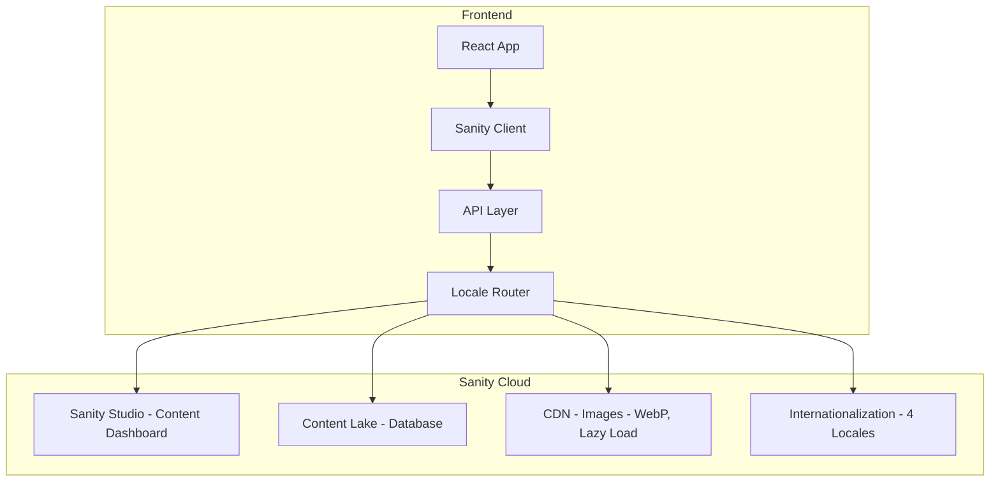

# Sanity.io CMS Setup Plan for ChexPro Blog

## Overview
Set up Sanity.io as a headless CMS for the ChexPro blog with blog posts, categories, and authors, then migrate the existing 8 sample blog posts.

## Architecture

## Todo List

### Phase 1: Sanity Project Setup

- [ ] 1.1 Install Sanity CLI globally
- [ ] 1.2 Create new Sanity project using `npm create sanity@latest`
- [ ] 1.3 Configure project with ChexPro branding
- [ ] 1.4 Set up Sanity Studio deployment URL

### Phase 2: Content Schema Design

- [ ] 2.1 Create `author` schema - name, bio, image, social links
- [ ] 2.2 Create `category` schema - name, slug, description, color
- [ ] 2.3 **Add multi-language support to all schemas** - enable field-level translations
- [ ] 2.4 Configure supported locales: English, Spanish, French, Hindi
- [ ] 2.5 Create `post` schema with fields:
  - [ ] title, slug (localized)
  - [ ] author (reference)
  - [ ] mainImage with hotspot/crop
  - [ ] categories (array of references)
  - [ ] publishedAt date
  - [ ] excerpt (localized)
  - [ ] body (Portable Text rich text with translations)
  - [ ] seoTitle, seoDescription (localized)

### Phase 3: Frontend Integration

- [ ] 3.1 Install Sanity client packages: `@sanity/client`, `@sanity/image-url`, `portable-text-react`
- [ ] 3.2 Create `sanityClient.js` config file
- [ ] 3.3 Create image URL builder utility
- [ ] 3.4 Create **image optimization utility** with:
  - [ ] Automatic responsive image srcsets
  - [ ] WebP format conversion
  - [ ] Lazy loading support
  - [ ] Thumbnail generation
  - [ ] CDN URL builder with transformations
- [ ] 3.5 Create Portable Text components for rich text rendering
- [ ] 3.6 Update `ResourcesPage.jsx` to support locale-based content fetching
- [ ] 3.7 Create fallback logic when translated content is missing
- [ ] 3.5 Update `strapiClient.js` to `sanityClient.js` with new functions:
  - [ ] `fetchPosts()`
  - [ ] `fetchPostBySlug()`
  - [ ] `fetchCategories()`
  - [ ] `fetchAuthors()`
  - [ ] `fetchPostsByCategory()`

### Phase 4: Data Migration

- [ ] 4.1 Create migration script with **multi-language support**:
  - [ ] Parse existing English content
  - [ ] Create translated versions for ES, FR, HI
  - [ ] Use translation API for initial translations
  - [ ] Upload existing placeholder images to Sanity assets
  - [ ] Configure image metadata for all locales
- [ ] 4.2 Upload existing placeholder images to Sanity assets
- [ ] 4.3 Import 8 blog posts with categories and authors
- [ ] 4.4 Verify data integrity and translations in Sanity Studio

### Phase 5: Environment Configuration

- [ ] 5.1 Add Sanity environment variables to frontend/.env
- [ ] 5.2 Create .env.example with required keys
- [ ] 5.3 Update envConfig.js to include Sanity configuration
- [ ] 5.4 Set USE_FALLBACK_DATA=false to enable CMS

### Phase 6: Testing & Verification

- [ ] 6.1 Test blog listing page loads correctly
- [ ] 6.2 Test individual blog post pages
- [ ] 6.3 Test category filtering
- [ ] 6.4 Test **language switching** - verify translations display correctly
- [ ] 6.5 Verify image loading from Sanity CDN with optimized URLs
- [ ] 6.6 Test **responsive images** with different sizes and formats
- [ ] 6.7 Test mobile responsiveness

### Phase 7: Documentation

- [ ] 7.1 Document Sanity Studio access credentials
- [ ] 7.2 Document content update workflow
- [ ] 7.3 Update blogfunc.md with new CMS instructions
- [ ] 7.4 Add Sanity setup to PROJECT_HANDOVER.md

## Deliverables

1. **Sanity Studio**: Fully configured content management dashboard at `https://chexpro-blog.sanity.studio`
2. **Multi-Language Support**: Blog content in English, Spanish, French, and Hindi with field-level translations
3. **Image Optimization**: Automatic responsive images with WebP conversion, lazy loading, and CDN transformations
4. **API Integration**: Frontend fetches from Sanity API with locale-aware queries
5. **Content Migration**: All 8 existing blog posts migrated with categories, authors, and translations
6. **Documentation**: Complete guide for content editors and developers

## Next Steps

Once approved, I'll switch to Code mode to begin implementation.
