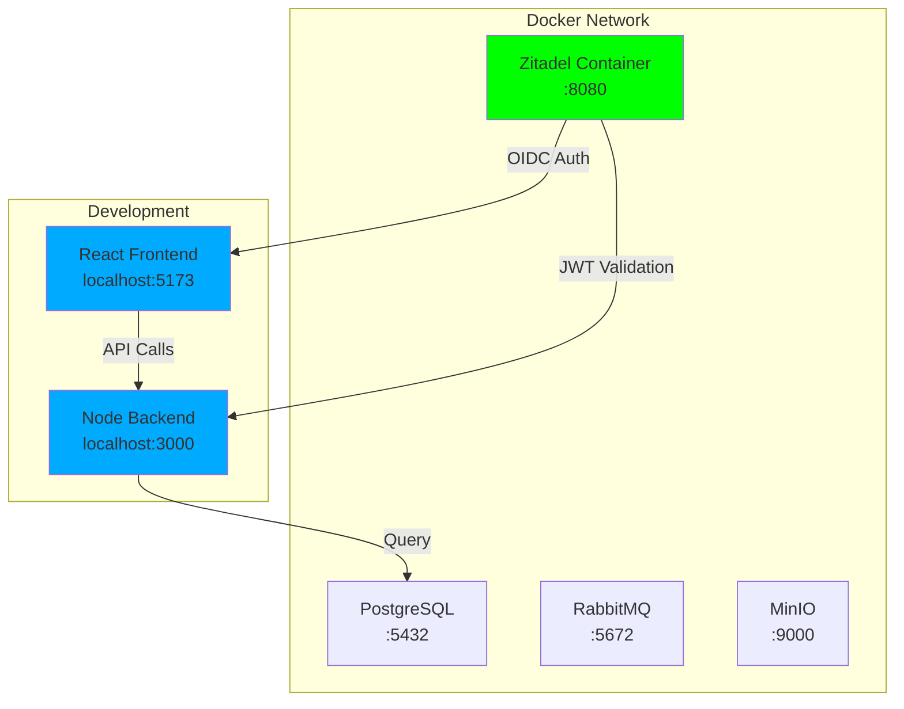
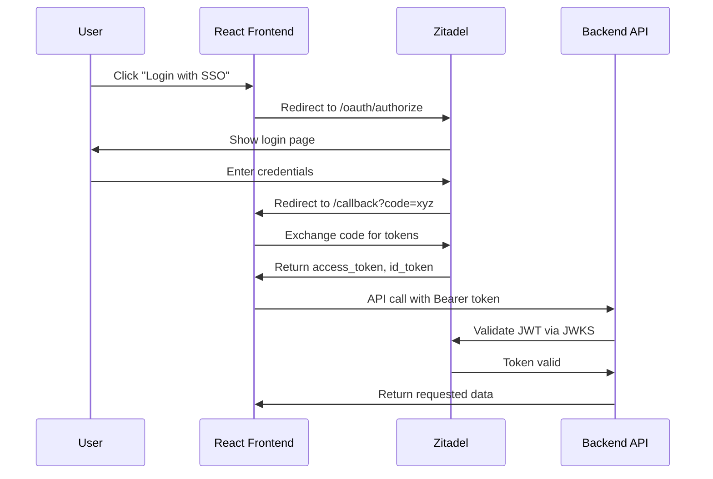

# Zitadel Setup Plan - Complete Local Implementation

## Current State Analysis

### ✅ Already Complete
- **Docker Compose**: `docker-compose.zitadel.yml` configured with PostgreSQL, MinIO, RabbitMQ
- **Frontend Packages**: `@zitadel/react` and `@zitadel/client` already in `frontend/package.json`
- **Backend Packages**: `jwks-rsa`, `jsonwebtoken`, `@grpc/grpc-js` already in `server/package.json`
- **Frontend Auth**: `ZitadelAuthContext.jsx`, `useZitadelAuth.js`, `zitadelClient.js`, `ZitadelLoginButton.jsx`
- **Backend Auth**: `zitadelAuth.js` middleware with JWT validation
- **Environment Templates**: `.env.zitadel.example` exists

### ❌ Missing / Broken
- **Initialization Script**: `scripts/zitadel-init.sh` only contains Windows path
- **Environment File**: `.env.zitadel` not created from template
- **Zitadel Instance**: Not started yet
- **Configuration**: No Zitadel organization/project/apps created

---

## Architecture Overview



---

## Step-by-Step Implementation Plan

### Step 1: Create `.env.zitadel` from Template

```bash
# Copy the template
cp .env.zitadel.example .env.zitadel
```

**Purpose**: Configure Docker environment variables for Zitadel services

---

### Step 2: Create/Fix `zitadel-init.sh` Script

The script needs to:
1. Wait for Zitadel to be healthy
2. Create an organization
3. Create a project
4. Create two applications (frontend, backend)
5. Configure roles (employer, candidate, admin)
6. Output configuration for environment files

**Key Zitadel Admin API Endpoints**:
- `POST /admin/v1/organizations` - Create organization
- `POST /admin/v1/projects` - Create project
- `POST /admin/v1/projects/{id}/apps` - Create applications
- `POST /admin/v1/projects/{id}/roles` - Create roles

---

### Step 3: Start Docker Containers

```bash
# Start Zitadel and dependencies
docker-compose -f docker-compose.zitadel.yml up -d

# Check logs to ensure healthy
docker-compose -f docker-compose.zitadel.yml logs -f
```

**Wait for**: Zitadel health check to pass (`/healthz` returns 200)

---

### Step 4: Run Initialization Script

```bash
# Make executable and run
chmod +x scripts/zitadel-init.sh
./scripts/zitadel-init.sh
```

**Expected Output**:
```
========================================
ZITADEL CONFIGURATION
========================================
ZITADEL_ADMIN_USER: admin@example.com
ZITADEL_ADMIN_PASSWORD: <generated-password>

# Frontend Configuration
VITE_ZITADEL_CLIENT_ID: <uuid>
VITE_ZITADEL_CLIENT_SECRET: <uuid>

# Backend Configuration
ZITADEL_BACKEND_CLIENT_ID: <uuid>
ZITADEL_BACKEND_CLIENT_SECRET: <uuid>

# Common
ZITADEL_ISSUER: http://localhost:8080
```

---

### Step 5: Configure Environment Files

#### Frontend `.env`:
```
VITE_ZITADEL_ISSUER=http://localhost:8080
VITE_ZITADEL_CLIENT_ID=<from-init-output>
VITE_ZITADEL_CLIENT_SECRET=<from-init-output>
VITE_ZITADEL_REDIRECT_URI=http://localhost:5173/callback
VITE_ZITADEL_LOGOUT_URI=http://localhost:5173/logout
```

#### Backend `.env`:
```
ZITADEL_ISSUER=http://localhost:8080
ZITADEL_CLIENT_ID=<from-init-output>
ZITADEL_CLIENT_SECRET=<from-init-output>
ZITADEL_JWKS_URI=http://localhost:8080/oauth/jwks
```

---

### Step 6: Start Development Servers

```bash
# Terminal 1: Frontend
cd frontend
npm run dev

# Terminal 2: Backend
cd server
npm run dev
```

---

### Step 7: Test Authentication Flow

1. Open browser to `http://localhost:5173`
2. Navigate to `/client-login`
3. Click "Login with Zitadel SSO"
4. Authenticate with Zitadel admin credentials
5. Verify user is redirected back with roles

---

## Zitadel Admin Console

After initialization:
- **URL**: http://localhost:8080/ui/console
- **Admin User**: From initialization output
- **Password**: From initialization output

---

## Expected Behavior



---

## Roles Configuration

| Role | Description | Access Level |
|------|-------------|--------------|
| `employer` | Employer Portal User | Can manage candidates, view reports |
| `candidate` | Candidate Portal User | Can track own background check |
| `admin` | System Administrator | Full access to all features |

---

## Troubleshooting

### Zitadel Not Starting
```bash
# Check logs
docker-compose -f docker-compose.zitadel.yml logs zitadel

# Check health
curl http://localhost:8080/healthz
```

### Initialization Fails
```bash
# Wait longer for Zitadel to be ready
sleep 30
curl http://localhost:8080/healthz
```

### Frontend Not Connecting
- Verify `VITE_ZITADEL_ISSUER` is correct
- Check CORS settings in Zitadel admin console

---

## Next Steps After Local Testing

1. **Commit to Git**: Push Zitadel configuration to main branch
2. **OCI Deployment Options**:
   - **Option A**: Zitadel Cloud (managed service)
   - **Option B**: Self-hosted on OCI Container Instances
   - **Option C**: Deploy alongside existing Odoo PostgreSQL
3. **Update DNS**: Point auth.chexpro.com to OCI instance
4. **Configure TLS**: Use existing Let's Encrypt certificate
5. **Update CORS**: Add production domains to allowed origins
