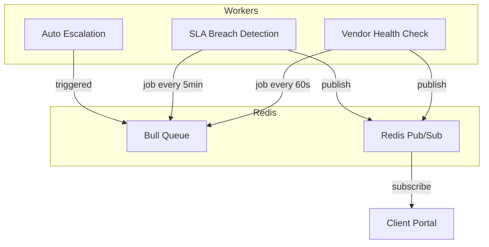

# Workers Implementation Plan - Sprint 1

## Overview
Implement Bull queue workers for vendor health checks, SLA breach detection, and auto-escalation with Redis pub/sub for cross-portal communication.

## Architecture



## Tasks

### TASK 1: Update Schema (prisma/schema.prisma)

**Add to Vendor model:**
```prisma
healthCheckUrl  String?  @map("health_check_url") @db.VarChar(500)
```

**Add OFFLINE to VendorStatus enum:**
```prisma
enum VendorStatus {
  active
  inactive
  maintenance
  suspended
  offline   // Worker-managed, auto-recovers
}
```

**Add EscalationRule model:**
```prisma
model EscalationRule {
  id            String   @id @default(cuid())
  name          String
  triggerType   String   // 'SLA_BREACH' | 'VENDOR_OFFLINE' | 'EXCEPTION_UNRESOLVED' | 'MANUAL'
  conditions    Json     // e.g. { "elapsedPercent": 100, "packageType": "CRIMINAL" }
  actions       Json     // e.g. [{ "type": "REASSIGN", "toRole": "opsmanager" }, { "type": "NOTIFY" }]
  delayMinutes  Int      @default(0)
  priority      Int      @default(1)
  isActive      Boolean  @default(true)
  createdAt     DateTime @default(now())
  updatedAt     DateTime @updatedAt
}
```

### TASK 2: Create workers/index.ts

- Connect to Redis via Bull using REDIS_URL from config
- Register 5 job processors:
  - vendor-health-check (every 60s)
  - sla-breach-detection (every 5min)
  - auto-escalation (on-demand + periodic)
  - notification-dispatch (on-demand)
  - order-status-sync (periodic, for client portal)
- Subscribe to Redis pub/sub channels:
  - `vendor:status:changed`
  - `sla:breached`
  - `order:new` (from client portal)
  - `order:status:changed` (from client portal)
- Log startup with logger
- Handle SIGTERM/SIGINT for graceful shutdown

### TASK 3: Create workers/vendorHealthCheck.ts

**Job: vendor-health-check** - Runs every 60 seconds

Process:
1. Query vendors WHERE status = 'ACTIVE' AND healthCheckUrl IS NOT NULL
2. For each vendor:
   - HTTP GET to healthCheckUrl with 5s timeout
   - If timeout or non-2xx: increment Redis failure count `vendor:failures:{vendorId}`
   - If consecutive failures >= 3: set vendor status to OFFLINE
     - Find next eligible vendor via VendorRoutingRule
     - Reassign all IN_PROGRESS orders from failed vendor
     - Reset failure count if vendor recovers after being set to offline
   - If success and was offline: set back to ACTIVE
3. Write result to VendorPerformance (responseTime, checkedAt)
4. Publish Redis event `vendor:status:changed` on status change

### TASK 4: Create workers/slaBreachDetection.ts

**Job: sla-breach-detection** - Runs every 5 minutes

Process:
1. Query orders WHERE status NOT IN ['COMPLETED', 'CANCELLED', 'DELIVERED']
2. For each order, find SLAConfig (clientId + packageId, fallback to default)
3. Calculate elapsedMs = Date.now() - order.createdAt
4. If elapsed >= 80% of SLA target AND no warning alert exists:
   - Create SLAAlert (type: warning)
   - Dispatch notification-dispatch job to assigned processor
5. If elapsed >= 100% AND no breached alert exists:
   - Create SLAAlert (type: breached)
   - Publish Redis event `sla:breached`
   - Add auto-escalation job for this order

### TASK 5: Create workers/autoEscalation.ts

**Job: auto-escalation** - On-demand (from SLA breach) or periodic

Process:
1. Accept orderId as job data
2. Query EscalationRule WHERE isActive = true AND triggerType = 'SLA_BREACH'
3. For each matching rule:
   - Check conditions match order (packageType, client tier, etc.)
   - Apply actions after delayMinutes:
     - REASSIGN: reassign order to user with specified role
     - NOTIFY: create AdminNotification + send email
     - ESCALATE: set escalation_level on order
4. Log all actions to AdminAuditLog

## Implementation Notes

- Use raw SQL (prisma.$queryRaw) for client portal tables (orders, clients)
- Use AdminNotification model + nodemailer for notifications
- Redis keys for failure tracking: `vendor:failures:{vendorId}`
- All errors caught and logged - never crash worker
- Use config.redisUrl from backend/src/config/env.ts
- Use logger from backend/src/config/logger.ts
